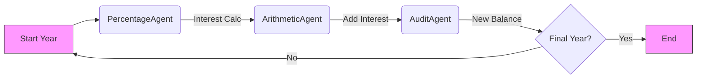

# 🤖 Multi-Agent Financial Computation System


> **A deterministic, agentic compound interest calculator that proves you don't need a brain (LLM) to be smart.**

---

## 📖 Overview
This project demonstrates a rigorous **Multi-Agent System** capable of performing precise financial calculations without relying on Large Language Models (LLMs). Built using **CrewAI**, it orchestrates three specialized agents in a strictly sequential pipeline to simulate compound interest over time.

🚀 **Why this matters**: It solves the "execution problem" in agentic frameworks, proving that agents can reliably execute pure Python logic even in "headless" environments.

---

## ✨ Key Features

| Feature | Description |
| :--- | :--- |
| **🧠 Deterministic Execution** | 100% accurate results using pure Python logic. No hallucinations. |
| **🔄 Sequential Pipeline** | `PercentageAgent` → `ArithmeticAgent` → `AuditAgent`. |
| **📈 Compound Loop** | Simulates multi-year growth (e.g., 5 years) by persisting state between cycles. |
| **🛠️ RunnableTask** | Custom implementation that forces function execution when `llm=None`. |
| **📊 JSON Logging** | Clean, structured JSON output for every agent interaction. |

---

## 🚀 Quick Start

### 1. Prerequisites
Ensure you have **Python 3.10+** installed.

### 2. Installation
Install the required framework:
```bash
pip install crewai
```

### 3. Usage
Run the simulation:
```bash
python src/main.py
```

---

## 🔍 How It Works

The system calculates compound interest step-by-step for each year.

### The Pipeline


### Example Output
For **Principal: 20,000**, **Rate: 10%**, **Time: 5 Years**:

```text
p = 20000, r = 10, t = 5

Year 1 → 22000
Year 2 → 24200
Year 3 → 26620
Year 4 → 29282
Year 5 → 32210

Final Compound Balance after 5 years: 32210.0
```

---

## ⚙️ Technical Deep Dive

<details>
<summary><strong>Why `RunnableTask`? (Click to Expand)</strong></summary>

Standard CrewAI agents rely on an LLM to decide when to call tools. When `llm=None` (headless mode), they fail to execute provided function logic because they lack the "brain" to trigger the action.

To solve this, we implemented **`RunnableTask`**, a subclass of `crewai.Task`:
1.  **Overrides** `execute_sync` to bypass the LLM.
2.  **Explicitly runs** the provided Python function.
3.  **Wraps** the result in a `TaskOutput` object to satisfy CrewAI's internal state requirements.

This ensures your deterministic code runs seamlessly within the agentic framework.
</details>

<details>
<summary><strong>Project Structure</strong></summary>

```
src/
├── agents/             # Agent definitions (Role, Goal, Backstory)
├── tools/              # Pure Python logic/tools used by agents
└── main.py             # Main coordinator script & RunnableTask
```
</details>

---

## 👨‍💻 Author

**Abhishek Dixit**
*Backend Intern Assignment - SteinnLabs*

---
*Built with ❤️ and Python.*
